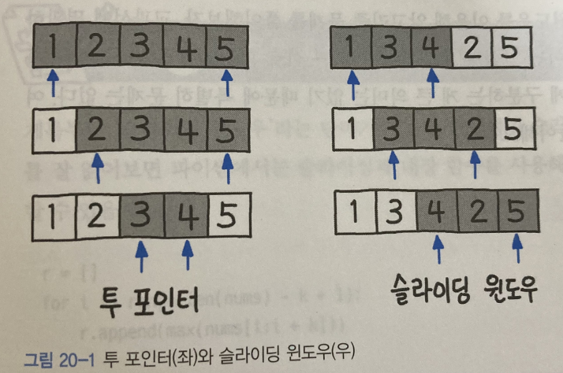

# Sliding Window
- *고정 사이즈의 윈도우* 가 이동하면서 윈도우 내에 있는 데이터를 이용해 문제를 풀이하는 알고리즘
- *교집합의 정보를 공유하고, 차이가 나는 양쪽 끝 원소만 갱신하는 방법* 입니다.
- 배열이나 리스트 요소의 일정 범위 값을 비교할때 사용하면 좋음
- 투포인터 알고리즘과 연동하여 많이 쓰임
  - 투포인터 : 1차원 배열이 있고, 이 배열에서 각자 다른 원소를 가리키는 2개의 포인터를 조작하며 원하는 값을 얻는 형태
  
  - 투포인터는 구간의 넓이가 변하지만, 슬라이딩 윈도우는 항상 구간의 넓이가 고정되어있다.

